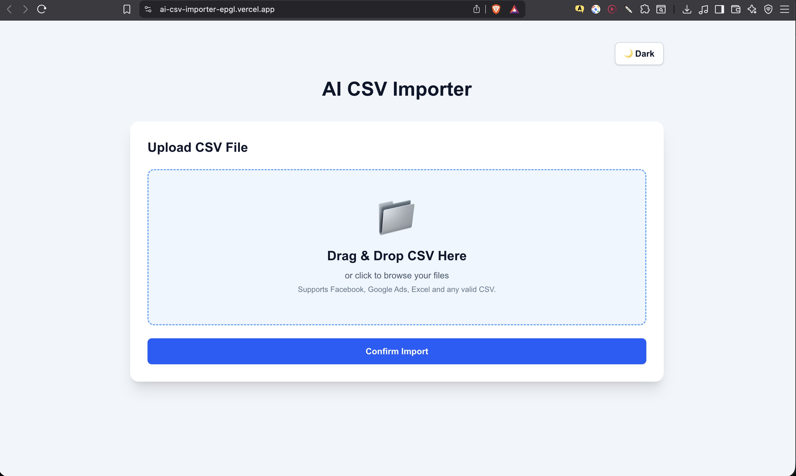
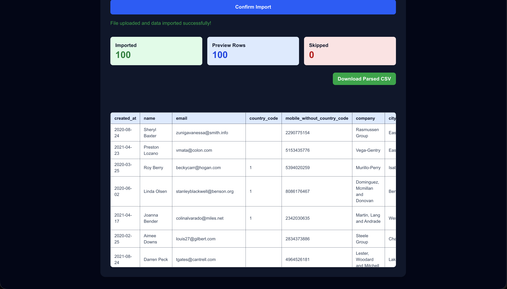

# AI CSV Importer

An AI-powered CSV import application that intelligently converts unstructured CSV files into standardized CRM records using **Groq LLMs**. Built with **Next.js**, **Node.js**, **Express**, and **Tailwind CSS**.

> Upload any CSV → Preview data → AI maps it into CRM fields → Download structured records.

---

##  Features

-  Drag & Drop CSV Upload
-  CSV Preview before import
-  AI-powered CRM field mapping using Groq
-  Progress indicator during processing
-  Automatic retry mechanism for failed AI requests
-  Download processed CRM data as CSV
-  Dark / Light Mode
-  Batch processing for large CSV files
-  Responsive UI
-  Deployed on Vercel + Render

---

##  Screenshots

> Replace these images with screenshots from your project.

### Home Page



### CSV Preview


### AI Parsed CRM Records


### Dark Mode



---

# Tech Stack

## Frontend

- Next.js 16
- React
- TypeScript
- Tailwind CSS
- Axios
- PapaParse

## Backend

- Node.js
- Express.js
- Multer
- csv-parser

## AI

- Groq API
- Llama 3.3 70B Versatile

## Deployment

- Vercel (Frontend)
- Render (Backend)

---

# 📂 Project Structure

```text
ai-csv-importer
│
├── frontend
│   ├── app
│   ├── components
│   ├── public
│   └── ...
│
├── backend
│   ├── controllers
│   ├── routes
│   ├── services
│   ├── utils
│   └── ...
│
└── README.md
```

---

# Installation

## 1. Clone Repository

```bash
git clone https://github.com/harjotdhiman-ops/ai-csv-importer.git

cd ai-csv-importer
```

---

## 2. Backend

```bash
cd backend

npm install

npm start
```

Backend runs on:

```
http://localhost:5001
```

---

## 3. Frontend

```bash
cd frontend

npm install

npm run dev
```

Frontend runs on:

```
http://localhost:3000
```

---

# 🔑 Environment Variables

## Backend

Create:

```
backend/.env
```

```env
GROQ_API_KEY=your_groq_api_key
PORT=5001
```

## Frontend

Create:

```
frontend/.env.local
```

```env
NEXT_PUBLIC_API_URL=http://localhost:5001
```

For production, set:

```env
NEXT_PUBLIC_API_URL=https://your-render-url.onrender.com
```

---

# AI Workflow

```text
Upload CSV
      │
      ▼
CSV Parsing
      │
      ▼
Batch Processing
      │
      ▼
Groq LLM
      │
      ▼
Structured CRM Records
      │
      ▼
Download CSV
```

---

# Processing Pipeline

1. Upload CSV
2. Parse CSV rows
3. Split into batches
4. Send each batch to Groq
5. Retry failed requests automatically
6. Merge AI responses
7. Display CRM table
8. Download processed CSV

---

# Live Demo

**Frontend**

```
https://YOUR-VERCEL-URL.vercel.app
```

**Backend**

```
https://YOUR-RENDER-URL.onrender.com
```

---

# Future Improvements

- Streaming AI responses
- Virtualized tables for very large CSV files
- Multiple CRM templates
- Authentication
- Team workspaces
- Import history
- File validation dashboard

---

# Author

**Harjot Singh**

GitHub: https://github.com/harjotdhiman-ops

---

<<<<<<< HEAD
## ⭐ If you found this project useful, consider giving it a star!
=======
## ⭐ If you found this project useful, consider giving it a star!
>>>>>>> 9113ccc (Add README and project screenshots)
